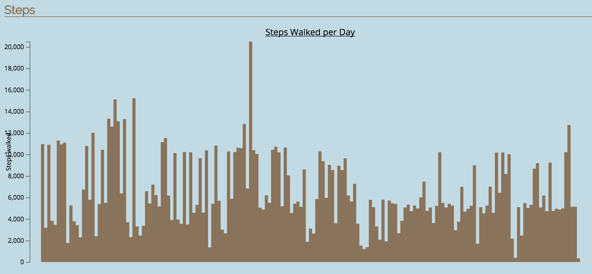
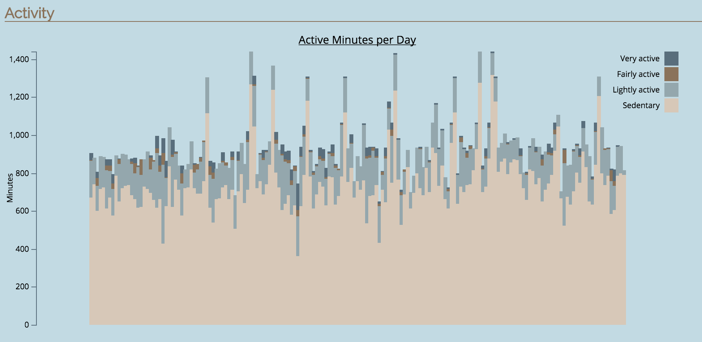

# Fitbit Analysis

A tool for analysing Fitbit data and graphing the results. CSV data (available on the Fitbit site) can be uploaded and analysed.

## Calculations
Various calculations are performed on the data, including:
* Lifetime calculations for Steps, Calories, Floors, Distance and Sleep.
* Average calculations for Steps, Calories, Floors, Distance and Sleep.
* Highest day calculations for Steps, Calories, Floors, Distance and Activity.
* Lowest day calculations for Steps, Calories, Floors and Distance.

## Graphs
Graphs show a users progress over time.

## Technical Details
Written in Ruby on Rails. The D3 Javascript library is used render the graphs.