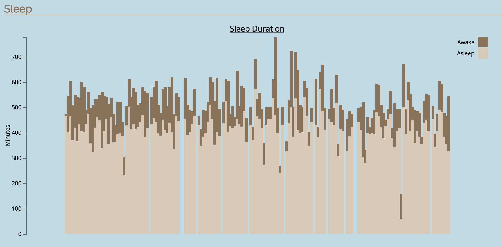

# Fitbit Analysis

A tool for analysing fitbit data and graphing the results. Data is uploaded as csv data from the Fitbit site.

## Calculations
Various calculations are performed on the data, including:
* Lifetime calculations for Steps, Calories, Floors, Distance and Sleep.
* Average calculations for Steps, Calories, Floors, Distance and Sleep.
* Highest day calculations for Steps, Calories, Floors, Distance and Activity.
* Lowest day calculations for Steps, Calories, Floors and Distance.

## Graphs
Graphs are provided to show progress over time.

## Technical Details
Written in Ruby on Rails, using D3 for the graphs.